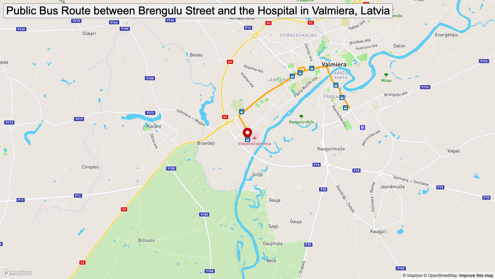

# Real-Time Bus Tracker

## Description
The Real-Time Bus Tracker is a web application that tracks the movement of a bus along its route between Brengulu Street and Hospital in Valmiera, Latvia. The application displays the bus stops along the route as markers and continuously moves a marker along the route to simulate the bus's movement. The project has been improved to include:
- Use of Mapbox GL JS for mapping functionality.
- Implementation of a marker that moves along the bus route.
- Displaying bus stop icons at each stop along the route.
- Changing the map style to street V11 theme.

## How to Run
To run the Real-Time Bus Tracker on your machine:
1. Clone this repository to your local machine.
2. Open the `index.html` file in your web browser. You can also use liveServer addon. 
3. At first it won't work. Go to mapanimation.js and search for const ACCESS_TOKEN = ''. Provide your token from mapbox there. 

## Roadmap of Future Improvements
Some additional features or improvements that could be made to enhance the Real-Time Bus Tracker:
- Integration with real-time bus location data to accurately track the bus's position according to the city bus schedule.
- Adding user interaction, such as allowing users to click on bus stops for more information.
- Improving the user interface and adding additional visual elements.

## License Information
This project is licensed under the MIT License. See it [here](./license)

## Screenshots

